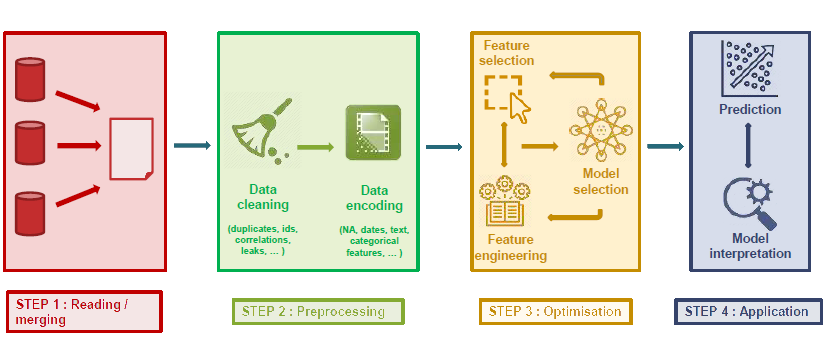

# Awesome AutoML

  

Source: 
  <a href="https://www.slideshare.net/AxeldeRomblay?utm_campaign=profiletracking&utm_medium=sssite&utm_source=ssslideview" target="_blank">Axel de Romblay, 2019 MLBox 0.8.2</a>

 

Awesome AutoML is a curated list of automated machine learning libraries and tools, inspired by [awesome-automl-papers](https://github.com/hibayesian/awesome-automl-papers), [awesome-AutoML-and-Lightweight-Models](https://github.com/guan-yuan/awesome-AutoML-and-Lightweight-Models), [awesome-AutoML](https://github.com/windmaple/awesome-AutoML), [awesome-automl](https://github.com/ChanChiChoi/awesome-automl) and other repositories. 

## Comparison

### Labels

|    | Supported| Not supported | Unknown |
|--|--|--|--|
| **Label** | :white_check_mark: | :heavy_minus_sign: | :grey_question: |

### Table

| Name         | Source                                 | Classification     | Regression         | Clustering         | Time series        | Image Classification | Object Detection   | Data cleaning      | Feature Engineering | Feature Selection  | Hyperparameter Tuning | Model Selection    | Model Evaluation   |
| ------------ | -------------------------------------- | ------------------ | ------------------ | ------------------ | ------------------ | -------------------- | ------------------ | ------------------ | ------------------- | ------------------ | --------------------- | ------------------ | ------------------ |
| AutoGluon    | https://github.com/awslabs/autogluon   | :white_check_mark: | :white_check_mark: | :heavy_minus_sign: | :heavy_minus_sign: | :white_check_mark:   | :white_check_mark: | :white_check_mark: | :white_check_mark:  | :white_check_mark: | :white_check_mark:    | :white_check_mark: | :white_check_mark: |
| TPOT         | https://github.com/EpistasisLab/tpot   | :white_check_mark: | :white_check_mark: | :heavy_minus_sign: | :heavy_minus_sign: | :heavy_minus_sign:   | :heavy_minus_sign: | :heavy_minus_sign: | :white_check_mark:  | :white_check_mark: | :white_check_mark:    | :white_check_mark: | :heavy_minus_sign: |
| FEDOT        | https://github.com/nccr-itmo/FEDOT     | :white_check_mark: | :white_check_mark: | :white_check_mark: | :white_check_mark: | :grey_question:      | :grey_question:    | :grey_question:    | :grey_question:     | :grey_question:    | :grey_question:       | :grey_question:    | :grey_question:    |
| NNI          | https://github.com/microsoft/nni       | :white_check_mark: | :white_check_mark: | :grey_question:    | :grey_question:    | :heavy_minus_sign:   | :heavy_minus_sign: | :grey_question:    | :white_check_mark:  | :white_check_mark: | :white_check_mark:    | :grey_question:    | :grey_question:    |
| auto-sklearn | https://github.com/automl/auto-sklearn | :white_check_mark: | :white_check_mark: | :heavy_minus_sign: | :heavy_minus_sign: | :heavy_minus_sign:   | :heavy_minus_sign: | :white_check_mark: | :white_check_mark:  | :white_check_mark: | :white_check_mark:    | :white_check_mark: | :white_check_mark: |
| Auto-PyTorch | https://github.com/automl/Auto-PyTorch | :white_check_mark: | :white_check_mark: | :heavy_minus_sign: | :heavy_minus_sign: | :white_check_mark:   | :heavy_minus_sign: | :white_check_mark: | :white_check_mark:  | :white_check_mark: | :white_check_mark:    | :white_check_mark: | :white_check_mark: |

#### Latest update

Updated on 19. November 2021 07:27:56 UTC

