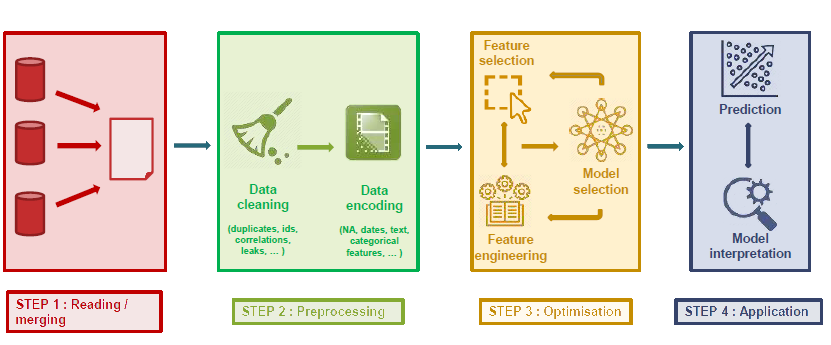

# Awesome AutoML

  
  Source: https://heartbeat.comet.ml/automl-the-next-wave-of-machine-learning-5494baac615f

Awesome AutoML is a curated list of automated machine learning libraries and tools. The idea was inspired by [hibayesian/awesome-automl-papers](https://github.com/hibayesian/awesome-automl-papers), [guan-yuan/awesome-AutoML-and-Lightweight-Models](https://github.com/guan-yuan/awesome-AutoML-and-Lightweight-Models), [windmaple/awesome-AutoML](https://github.com/windmaple/awesome-AutoML), [ChanChiChoi/awesome-automl](https://github.com/ChanChiChoi/awesome-automl) and other awesome repositories. 

## Comparison

### Labels

|    | Supported| Not supported | Unknown |
|--|--|--|--|
| **Label** | :white_check_mark: | :heavy_minus_sign: | :grey_question: |

### Table

<!-- include public/sheet.md -->

#### Latest update

Updated on <!-- include public/datetime.md -->